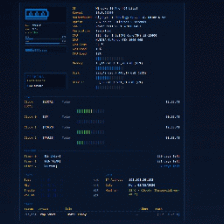

# Terminal Dashboard

Wallpaper Engine web wallpaper — terminal-style dashboard with clocks, weather, countdown timers, audio visualization, and media integration.

**Works out of the box** after install (Workshop or local). **Optional** Windows companion adds live CPU / RAM / GPU / disk stats.

- **Steam Workshop:** [Terminal Dashboard](https://steamcommunity.com/workshop/filedetails/?id=3732474243) (`3732474243`)
- **GitHub:** [G33K3R-od/terminal-wallpaper](https://github.com/G33K3R-od/terminal-wallpaper)



> If `preview.gif` is missing, open the project in Wallpaper Engine editor and create a snapshot — it will be saved to this folder.

---

## Features

| Always (no extra tools) | Optional (`setup.bat`, Windows) |
|-------------------------|----------------------------------|
| World clocks + local timezone | CPU / RAM / disk usage bars |
| Countdown timers | GPU temp & load (NVIDIA `nvidia-smi`) |
| Weather (Open-Meteo) | Host, user, Wi‑Fi, all drives |
| Bass / mid / treble / volume bars | Auto-start at logon |
| Spotify / browser media info | |
| Customizable in WE settings | |

---

## Quick start

### Wallpaper Engine

1. Copy `terminal-wallpaper` to:
   ```
   .../steamapps/common/wallpaper_engine/projects/myprojects/terminal-wallpaper/
   ```
   Or subscribe on **[Steam Workshop](https://steamcommunity.com/workshop/filedetails/?id=3732474243)**.

2. Apply the wallpaper in Wallpaper Engine.

3. Tune settings via the **gear icon** (clocks, timers, weather city, colors, language).

### Optional PC stats (Windows)

1. In the wallpaper folder, run **once**:
   - `setup.bat` — installs autostart + starts collector  
   - or `УСТАНОВИТЬ АВТОЗАПУСК.bat` (same)

2. A background task `TerminalDashboardStats` runs `collect-stats.ps1` and writes `stats.json` every ~2 s.

3. Remove autostart: `uninstall-autostart.ps1`

Without the script, the wallpaper uses **standalone mode** (no yellow border, no empty sysinfo block).

---

## Weather

In Wallpaper Engine settings:

- **Weather — city** — pick a city (e.g. Komsomolsk-on-Amur) or **Same as Clock 1**
- **Свои координаты** + **Weather — custom lat, lon** — e.g. `50.55, 137.01`

Requires internet (Open-Meteo API).

---

## Project structure

```
terminal-wallpaper/
├── index.html, style.css, script.js, config.js   # Web wallpaper
├── project.json                                  # WE properties & metadata
├── collect-stats.ps1                             # Stats collector (Windows)
├── install-autostart.ps1, setup.bat              # One-click setup
├── start-stats-hidden.vbs                        # Hidden start (no console)
├── WORKSHOP.txt                                  # Steam Workshop description
├── ИНСТРУКЦИЯ.txt                                # Guide (Russian)
└── README.md
```

---

## Settings (Wallpaper Engine)

- **Clocks 1–3** — label, timezone, show/hide  
- **Timers 1–3** — name, date `YYYY-MM-DD`  
- **Weather** — city or custom coordinates  
- **Show PC stats block** — off if you do not use `setup.bat`  
- **Display host / user** — decorative labels without the script (good for Workshop)  
- **Audio bar gain**, **UI scheme color**, **section language** (RU / EN)

Defaults for local preview: [`config.js`](config.js). In WE, `project.json` properties override them.

---

## Steam Workshop

**Published:** https://steamcommunity.com/workshop/filedetails/?id=3732474243

Full Workshop description (RU + EN, BBCode for Steam, GitHub & full-edition notes): [`WORKSHOP.txt`](WORKSHOP.txt).

### Description preview (RU)

**Terminal Dashboard** — терминальные обои: панель с тремя мировыми часами, локальным временем, погодой (Open-Meteo, список городов + свои координаты), тремя таймерами обратного отсчёта, аудио-полосами (bass/mid/treble/volume) и блоком медиа (Spotify / браузер через интеграцию WE). Тёмно-синий UI, подписи RU/EN, настройка через шестерёнку WE.

**Базовая версия** — сразу после подписки, без установки скриптов. **Полная версия (Windows)** — опционально: один запуск `setup.bat` из [репозитория на GitHub](https://github.com/G33K3R-od/terminal-wallpaper) добавляет живые CPU / RAM / GPU (NVIDIA) / диски / Wi‑Fi; в настройках включить *Show PC stats block*. Без скрипта — автономный режим без пустого блока PC.

Исходники, инструкция, обновления: **https://github.com/G33K3R-od/terminal-wallpaper**

Before publishing, delete (or do not commit):

- `stats.json`
- `.stats-autostart-installed`

Keep `setup.bat` in the package as an **optional** bonus for Windows users.

---

## Requirements

- [Wallpaper Engine](https://store.steampowered.com/app/431960/Wallpaper_Engine/) (Windows)
- Optional stats: Windows 10/11, PowerShell 5.1+, NVIDIA driver for GPU metrics
- Weather: network access from WE
- Media: WE **General** settings → media integration enabled

---

## License

[MIT](LICENSE)
